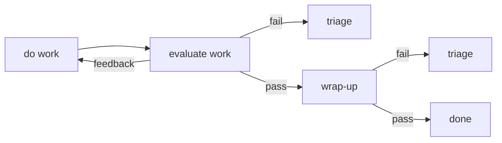

# Chuggernaut v2 — Job Lifecycle Generalization

Design for generalizing the job lifecycle beyond code-change jobs, sharpening the
feedback/failure distinction, and unifying triage. Extends `design.md`; section
references (§) are to `spec.md`.

**Status:** implemented (session 9) except triage agents, which wait on
factories (§13): `wrap_up: merge | none`, the `abort` verdict, the
wrap-up hard-failure escalation, and additive per-job evaluators are all
live and under test (`dispatcher/tests/execution.rs`, "Lifecycle
generalization" section). Spec deltas landed in §1.1, §1.2, §3.2, §3.3, §4.2,
§6.2.

---

## The lifecycle model

Every job, regardless of what it produces, moves through the same phases:



- **Work** — the fallible action: write code, run a deployment, produce a document.
- **Evaluation** — independent judgment of the work against declared criteria.
  Three outcomes: *pass* (proceed to wrap-up), *feedback* (actionable — re-enter
  work with the evaluators' structured output as context), *fail* (the work is
  not and cannot be satisfactorily completed — triage).
- **Wrap-up** — make the outcome durable and visible to the rest of the system.
  Wrap-up is platform-owned and designed to be infallible; in the rare
  unexpected failure it goes to triage, never silently wedges.
- **Triage** — escalate to a human, or create another job to help. Never a
  retry loop in disguise: triage exists because automation has run out.

Only the *contents* of wrap-up vary by job kind. The phases, edges, evaluator
machinery, rework loop, and escalation path are generic.

### Mapping to the implementation

| Model | Implementation |
|---|---|
| do work | `JobState::Work`, work task per §3.2 |
| evaluate work | `JobState::Evaluation`, evaluator fan-out/reduce per §3.3 |
| feedback edge | rework: re-enter Work at `cycle + 1` with `eval_context`, bounded by `rework_budget` |
| eval fail edge | escalation (budget exhausted, infra failure, or explicit abort — see below) → `JobState::Escalated` |
| wrap-up | `JobState::WrapUp`: merge queue, squash-merge, merge gate (§3.3) — for code jobs (`wrap_up: merge`) |
| wrap-up fail edge | conflict/gate failure → free rework (WrapUp→Work, recoverable); hard errors → escalation (WrapUp→Escalated, see below) |
| triage (pre-work) | `JobState::Stalled` — config re-validation failure or deadline-before-start; Retry/Revoke only |
| triage (post-work) | `JobState::Escalated` — Human escalation task (§3.4); triage agents generalize factories (§13) |
| done | `complete_done`: record Done, publish, delete branch, unblock dependents |

---

## Decision: jobs are not necessarily code changes

A deployment is a job. So is producing a report, running a data migration, or
any unit of work whose effect lives outside the repo. The work/eval/wrap-up
lifecycle applies unchanged; what differs is that there is no branch to merge,
so the merge-shaped wrap-up (squash, conflict rework, merge gate) does not apply.

### `wrap_up:` mode on the job type

```yaml
# .chug/jobs/deploy-staging.yaml
name: deploy-staging
wrap_up:
  type: none          # merge (default) | none
```

- **`merge`** (default) — today's behavior, unchanged: merge queue, squash-merge,
  conflict rework, merge gate. The invariant: nothing reaches the default branch
  untested against the exact tree that lands.
- **`none`** — eval-pass transitions directly to Done. No merge queue, no gate,
  no conflict path. Wrap-up degenerates to the platform bookkeeping every job
  gets at Done (state write, `job-done` event, branch cleanup, dependent
  unblocking) — which is the infallible kind: single-writer KV puts and event
  publishes, no external world involved.

The mode is consulted in exactly one place — after eval-pass — so the container
launch path, channel, and artifact capture do not fork on it.

### What eval means for non-code jobs

For a code job, evaluators judge the branch diff. For a deploy job they judge
the **world** — smoke tests against the environment the work phase mutated. The
evaluator machinery (command/agent/human, required/advisory, parallel fan-out,
reduce, rework with structured feedback) carries over untouched. "Deploy failed
smoke tests → rework with the failure context" is exactly the feedback edge.

### `base_ref` is a pinned config version

Every job keeps a `base_ref`: it pins which version of the job type YAML, deploy
scripts, and evaluator definitions the whole job runs against (repo-versioned
config). For `wrap_up: merge` jobs it is also the merge base and advances on
conflict rework. For `wrap_up: none` jobs it never moves — it is only the pin.

### The job branch stays, as scratch

`job/{seq}` is created for every job regardless of wrap-up mode. The workspace
clone flow, channel, and artifact capture all assume it. For `wrap_up: none`
it is simply deleted at Done without merging; commits on it are scratch by
definition.

### Job outputs: the structured result is the contract

A code job's output is implicit — the commit on the default branch, visible to
dependents because their `base_ref` is taken after the upstream is Done. A
deploy job's effect is external, so its output for dependents is the
`structured` payload from `submit_result` (deployed version, environment URL,
…). This is made the explicit, uniform contract: **a job's output is its
structured result**, and downstream jobs' inputs resolve to it. Code jobs
participate in the same rule (they can report the merged commit hash); the
graph semantics become one rule instead of two.

---

## Decision: feedback vs. failure is declared, not only inferred

Today an evaluator returns `pass: bool`, and the feedback/failure distinction is
made by the budget: fail with rework budget left means feedback; fail with
budget exhausted means triage. That default stays. But it cannot express "this
work is unsalvageable — do not retry": an agent evaluator that discovers the
job's premise is wrong burns every remaining rework cycle before a human sees it.

`submit_eval` gains a third verdict:

| Verdict | Meaning | Effect |
|---|---|---|
| `pass` | criteria met | count toward overall pass |
| `fail` | criteria not met, actionable | rework under budget, else escalate (unchanged) |
| `abort` | not satisfiable by rework | skip remaining budget, escalate immediately |

An `abort` from any **required** evaluator short-circuits the reduce to
escalation, carrying the evaluator's structured output as the escalation
context. Advisory evaluators cannot abort. Command evaluators keep the binary
exit-code verdict — an exit code cannot judge fixability — so `abort` is
available to agent and human evaluators only.

---

## Decision: wrap-up failure semantics

The diagram's "wrap-up fail → triage" edge is refined into two classes:

1. **Recoverable integration failures** — squash conflict because default HEAD
   moved, or merge-gate failure against the exact tree that would land. These
   re-enter Work as free rework (budget not consumed) with conflict/failure
   context handed to the agent. A rebase-and-retry is feedback-shaped;
   escalating every conflict to a human would defeat the point. (Unchanged.)
2. **Unexpected hard failures** — git plumbing errors, repo IO failures, any
   `Err` (not `Conflict`) out of wrap-up. These become an escalation task
   (WrapUp→Escalated), and the per-project merge queue advances past the job
   rather than stalling. Before this, such an error bubbled out of
   `try_finalize` into the message loop with no catch, wedging the job in the
   landing phase and stalling the queue. Wrap-up is designed to be infallible; when it fails anyway, a
   human finds out.

---

## Decision: triage has two outlets

Triage means the platform has run out of automation for *this* job. Its outlets:

1. **Escalate to a human** — the Human escalation task (§3.4), resolved with
   Retry / Resolve / Revoke. Today's only outlet; remains the fallback.
2. **Create another job to help** — generalizing factory triage agents (§13):
   an escalation may first run a **triage agent**, which either resolves the
   escalation itself, files a new job (with the failed job's context as input),
   or punts to the human task. The Human task becomes the floor, not the only
   option.

Triage agents are declared, not implicit — a job type (or project config) opts
in. An operator-facing escalation never silently becomes an agent decision.

### Manual triage (advisory) — the operator-dispatched middle ground

Between "escalate to a human" and "an agent creates a job" sits a third, human-in-
command outlet, live today: **manual triage**. When a job is `Escalated` or
`Stalled`, the operator can dispatch a triage agent (`POST .../jobs/{seq}/triage`,
§1.2) that reads the whole job state — brief, escalation reason, every task's
result, and the captured Stdout logs — and writes an **assessment +
recommendation** (`TaskPhase::Triage` / `TaskResult::Triage`). It is purely
advisory: it never changes job state (no §2.1 transition), so the operator still
owns the Retry / Resolve / Revoke decision — the assessment just informs it.
Unlike the declared triage agents above, it is dispatched on demand, not wired
into the escalation edge, and runs in a platform image (`TRIAGE_IMAGE`) so it
works on any job type. It is the "help me understand why this failed" button,
distinct from "let automation try once more."

---

## Decision: eval criteria are a floor, additive per job

Evaluators are declared in `.chug/jobs/{type}.yaml` at `base_ref` — repo-versioned,
like GitHub Actions workflows. A full per-job override would let a job creator
silently drop the type's merge-gate protections, so overrides are rejected.

Instead, job creation accepts **additive** evaluators: the type's evaluators
are a floor; a job may layer extra criteria on top (e.g., a factory-created job
adding a check specific to its instructions). The GH Actions parallel holds:
`workflow_dispatch` parameterizes a run, it does not rewrite the steps. A
genuinely different eval profile is a different job type — types are cheap,
they live in the repo.

---

## Vocabulary

The data model already has exactly two execution concepts; the language
everywhere (spec, UI, docs) should use them consistently:

- **Job** — the node in the graph: the unit of delivery, with a lifecycle
  (work → evaluate → wrap-up → done), a branch, a base_ref. Jobs are
  *instances of a job type*.
- **Task** — one execution: a container run, an agent run, or a human action.
  **Both the work phase and the evaluation phase run tasks** — a work task,
  then one evaluation task per evaluator (spec §1.2's chronological task
  log). "Evaluator" names an evaluation *slot declared on the type*; the
  thing that executes is a task.
- **Job type** — the declarative definition (`.chug/jobs/{type}.yaml`): which work
  task to run, which evaluation tasks judge it, wrap-up mode, budgets. The
  library UI shows these.

What does *not* exist as a first-class concept: "action", "step", "check" —
those are all just tasks, differing only in kind (command/agent/human) and in
which phase runs them.

## Proposed: composable evaluation criteria (eval packs)

*Status: proposal — not yet implemented.*

Declaring evaluators inline works, but criteria want to be **defined once and
reused** — "run these tests", "security review with these instructions" — and
composed per job type or per job, the way GitHub Actions composes actions into
workflows. The building blocks already exist: evaluators are the actions
(command = `run:`, agent = an `instructions.md`), `_defaults.yaml` is already
a reusable pack applied project-wide, and per-job evaluators are already
additive. What's missing is the middle tier: named, repo-versioned packs that
can be referenced instead of restated.

### Eval packs: `evals/{name}.yaml`

A pack is a named list of evaluator steps, versioned in the repo like job
types:

```yaml
# evals/full-ci.yaml
steps:
  - name: unit
    type: command
    run: cargo test --workspace
  - name: lint
    type: command
    run: cargo clippy --all-targets
  - name: security-review
    type: agent
    prompt: evals/full-ci/instructions.md   # the pack's agent action
```

Job types (and job creation, and `_defaults.yaml`) reference packs with
`use:`, GHA-style, alongside inline evaluators:

```yaml
# .chug/jobs/implement-endpoint.yaml
eval:
  - use: full-ci
  - name: human-approval
    type: human
    prompt: .chug/prompts/eval/human-approval.md
```

```json
// POST .../jobs — per-job criteria without restating anything
{ "type": "implement-endpoint", "eval": [ { "use": "smoke-prod" } ] }
```

### Semantics: expansion, not a new execution model

A `use:` entry **expands at job-type load time** (exactly where
`_defaults.yaml` merges today) into its steps, name-prefixed
`{pack}/{step}` (`full-ci/unit`, `full-ci/lint`). After expansion the
dispatcher sees a flat evaluator list — fan-out, reduce, merge gate, rework
context, restart reconciliation, and the UI all work unchanged. Collision and
field rules apply to the expanded list; packs resolve from `base_ref` like
everything else. A `use:` may set `required:` for the whole pack (each step
inherits it).

This deliberately mirrors GHA's composite actions: composition is a
config-time convenience, not a runtime construct.

### Ordering: `needs:` within the round, only if demanded

Steps expand into the existing *parallel* round. Ordering ("don't run the
expensive agent review until unit tests pass") is a real want but adds a
scheduling stage to the eval round. If/when needed, the smallest honest
version is a `needs: [name]` field on an evaluator (GHA again): the round
fans out in dependency waves; a step whose `needs` failed is recorded as
skipped-fail. Not proposed for the first cut — fail-fast economics matter
less while eval containers are cheap relative to work containers, and
`required: false` plus command-internal sequencing (`cmd1 && cmd2`) covers
most of it.

### Why not steps *inside* one evaluator?

A single evaluator whose `steps:` run sequentially in one container looks
attractive (one verdict, fail-fast for free) but breaks the per-evaluator
contract everywhere else: per-step images are impossible in one container,
the merge gate filters by evaluator type (a mixed command+agent step list is
neither), findings lose per-step structure, and reconciliation would need a
sub-task model. Expansion keeps one concept (the evaluator) and one log (the
task).

### Resolution: reusable tasks are files, not a new schema (DECIDED)

The task-definition YAML sketched in earlier drafts turned out to be
unnecessary. The insight (GHA "actions", sharpened): **a reusable command
task is just a script; a reusable agent task is just a markdown instructions
file** — and the evaluator schema already references both by path:

```yaml
eval:
  - name: ci
    type: command
    run: ./.chug/tasks/ci.sh          # the reusable command task IS the script
  - name: review
    type: agent
    prompt: .chug/tasks/review-code.md # the reusable agent task IS the markdown
```

Convention: reusable tasks live under `.chug/tasks/` in the project repo
(`.chug/tasks/*.sh` command tasks, `.chug/tasks/*.md` agent tasks), seeded by the
platform starter template. Reuse across job types is a shared path; a
project-wide gate is the same line in `.chug/jobs/_defaults.yaml`. No `use:`
indirection, no TaskDef schema, no expansion pass — the file is the unit,
git is the registry. What remains from the packs proposal, if ever needed:
`needs:` ordering within a round, and per-evaluator images for
heterogeneous toolchains (already supported via `image:`).

### Migration sketch

1. `EvalRef = Use { use, required? } | Inline(Evaluator)` in the `eval:`
   schema (types), accepted in job types, `_defaults.yaml`, and job creation.
2. Pack loading + expansion + prefix/collision validation in
   `release::load_job_type` (same place `_defaults` merges), resolved at
   `base_ref`.
3. `req.jobs.criteria` annotates expanded steps with their pack
   (`source: "pack:full-ci"`), so the UI shows where criteria came from.
4. UI: create form gains a pack picker (enumerate `evals/*.yaml` like job
   types) next to the inline evaluator rows.

---

## Proposed: per-job retros (retrobot)

*Status: proposal — not yet implemented.*

Every finished job leaves a complete record behind: the ticket (title/brief),
the work and eval transcripts (`session.jsonl` per agent task), the channel
narration, the eval findings and rework cycles, the merge/gate outcome, and
token usage. Today that record is only read when something went wrong. The
proposal: **a retro pass over every completed job**, run as a batch or async
so it never sits on the critical path.

### Shape

A **retro is itself a job** — the machinery already exists:

- **Trigger**: a factory (§13) bound to `job-done` / `job-escalated` events,
  batching (e.g. daily, or every N completions) rather than per-job — retros
  are cheap to defer and better with contrast across several jobs.
- **Work task**: an agent ("retrobot") with the completed jobs' archives as
  input: briefs, transcripts, channel history, eval findings per cycle,
  outcomes, usage. Its instructions: what went well/badly, where the agent
  flailed (rework loops, wrong assumptions, missing context), what the
  evaluator caught or missed, what was expensive.
- **Wrap-up: `none`** — the deliverable is the structured result (the retro
  report) plus its own transcript, not a merge.

### The output contract: suggestions, not writes

Retrobot **proposes durable artifacts; a human (or a follow-up job) persists
them**. Suggestion kinds, each mapping to something the platform already
versions:

| Suggestion | Lands as |
|---|---|
| "agents keep re-discovering X about this codebase" | a new/updated `.chug/tags/{tag}.md` knowledge tag |
| "the work prompt caused Y misbehavior repeatedly" | an edit to `.chug/prompts/work/*.md` / `.chug/tasks/*.md` |
| "this eval keeps passing broken Z" | a new evaluator / tightened instructions in `.chug/jobs/*.yaml` |
| "rework budget N is always exhausted / never touched" | budget tuning in the job type |
| "operator had to intervene for W" | a doc/note (`docs/`, README) or a follow-up job |

Structured result shape: `{ suggestions: [ { kind: tag|prompt|evaluator|
budget|doc, target_path, rationale, proposed_content } ] }` — concrete enough
that accepting one is either "commit this diff" (a human clicks, or a
follow-up **Code job whose ticket is the suggestion**, closing the loop:
retros feed the same lifecycle they observe).

### Why suggestions must gate through review

Retro output writes to exactly the files that steer every future agent
(prompts, tags, evaluators). Auto-committing would let one bad retro poison
the whole project's behavior — and repo-versioned config means acceptance is
already a first-class, reviewable act (a commit, or a Code job with the
merge gate behind it). Same principle as evaluators: the platform proposes,
the repo records, humans own the floor.

### Prerequisites / notes

- Factories (§13) are the natural trigger and are unimplemented — retros are
  a strong second consumer for that slice (first: ingest).
- Needs an "archive bundle" accessor: one call returning a completed job's
  brief + transcripts + channel history + findings (all stored today, but
  fetched piecemeal). Useful for the UI too ("download job archive").
- The UI's inbox could grow a "suggestions" section — retro proposals with
  accept (creates the commit / Code job) and dismiss actions.
- Cost control: batch retros on a cheap model by default; escalate a deep
  retro only for escalated/expensive jobs.

## Deferred

- **`wrap_up: custom` (user-defined wrap-up steps).** Reintroduces a fallible,
  retry-ambiguous phase exactly where infallibility is wanted. Everything a
  custom step would do — tag a release, notify, update a registry — lives
  either at the end of the work phase (which already has feedback/retry
  semantics) or as a small downstream job. Two modes cover code and not-code;
  resist the third until something truly cannot be expressed.
- **`wrap_up: tag` (platform-owned deploy record in git).** Advancing a
  `deployed/{env}` ref to `base_ref` at Done — repo-versioned record of what is
  running where, near-infallible fast-forward the dispatcher owns. Attractive,
  but the structured result on the Done job already carries "version X went to
  environment Y"; build it when something needs to read it from git.
- **Concurrency groups.** The merge queue incidentally serializes wrap-up
  per project; `wrap_up: none` jobs skip it, so two deploys to the same
  environment could run concurrently. The honest fix is a `concurrency:` group
  on the job type (GH Actions precedent): jobs in the same group do not enter
  Work while another is active. Separate small mechanism; defer until a real
  deploy type needs it.
